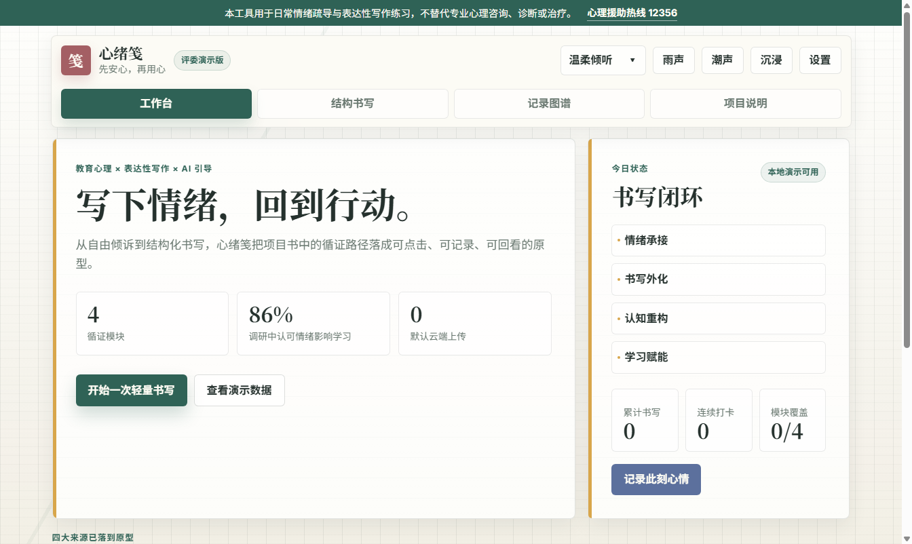

# 心绪笺 · 前端演示原型

心绪笺是一个面向大学生学业情绪支持的前端演示原型。项目以“先安心，再用心”为核心思路，将表达性写作、日常情绪书写、CBT 认知改写和成长叙事四类方法整合为可交互的书写工作台。

本仓库用于项目展示与课程评审，重点呈现功能结构、交互流程、情绪记录闭环与安全边界。

## 在线预览

本项目可通过 GitHub Pages 直接访问。页面部署完成后，访问仓库右侧的 Pages 链接即可体验。

## 演示文件

- `index.html`

该文件为便携单页版，已内联页面结构、样式和脚本。它同时适配桌面端和移动端，适合直接提交、复制和展示。

虽然本原型可以直接双击打开，但我们仍然推荐您使用 Microsoft Edge 或 Google Chrome 浏览器运行，以获得更稳定的图表、动效和本地存储体验。

## 核心功能

- 四大结构化书写模块：
  - 经典书写
  - 日常情绪书写
  - CBT 认知改写
  - 成长叙事
- 分步书写引导
- 本地书写记录保存
- 情绪评分与趋势图谱
- 自由倾诉入口
- 本地演示引导与可选 AI 增强模式
- 沉浸书写模式
- 危机关键词识别与求助资源提示
- 本地数据清空与隐私说明

## 运行方式

直接使用浏览器打开 `index.html` 即可，无需安装依赖，也无需启动后端服务。

虽然未配置 API 密钥时也可以完整体验主要流程，但我们仍然推荐您在需要展示 AI 增强回复时，提前在右上角“设置”中填写 API 接口、模型名称和 API 密钥。

未填写 API 密钥时，系统会自动使用本地演示引导。

## 数据与隐私

本原型默认使用浏览器本地存储保存书写记录和情绪评分，不进行默认云端上传。

页面中的情绪评分和图谱仅作为自我观察参考，不构成心理诊断。项目不替代专业心理咨询、诊断或治疗。

## 安全边界

当输入内容包含自伤、他伤或极端失控等高风险表达时，系统会优先触发求助提示，并引导用户联系心理援助热线或紧急求助资源。

## 评审说明

相比早期单一对话式树洞，本版本已将项目书中的“四大来源”转化为可点击、可填写、可保存、可回看的前端流程。它更适合展示心绪笺从情绪承接、书写外化、认知重构到学习行动的完整产品闭环。
